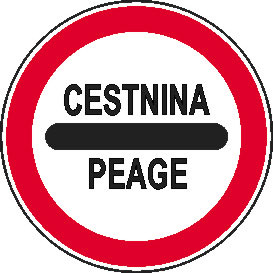
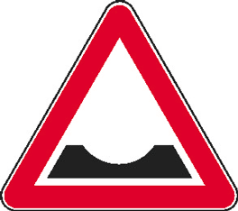

Osamelci med slikami
====================

   

Namesto s podatki v tabeli bomo v tej nalogi operirali s slikami. Med 70 prometnimi znaki (zbrani so v direktoriju `traffic-signs`) bomo s silhueto razbrali najbolj atipične.

1. Algoritmi, ki smo jih obravnavali, potrebujejo podatke v atributnem zapisu. Zato za pretvorbo slike v vektor števil implementirajte funkcijo `embed`.  Pri tem si pomagajte s [knjižnjico Torch in že zgrajeno mrežo](https://pytorch.org/hub/pytorch_vision_squeezenet/). Uporabite nevronsko mrežo SqueezeNet 1.1.

2. Implementirajte branje direktorija slik (s poddirektoriji) v slovar vektorjev števil (funkcija `read_data`), ki kot ključe vsebuje imena slik s pripadajočimi poddirektoriji. 
 
3. Za izračun razdalje med vektorji, ki opisujejo slike, potrebujemo drugačno razdaljo - uporaba evklidske ali manhattanske razdalje tu ni smiselna. Zato implementirajte razdaljo med vektorji, ki temelji na kosinusni podobnosti (funkcija `cosine_dist`). Kot razdaljo vzemite kar (1 - kosinusna podobnost); možnosti za implementacijo je sicer vič.

4. Razvijte računanje silhuete (funkcijo `silhouette` za en primer in `silhouette_average`za povprečje vseh primerov), ki lahko prejme poljubno funkcijo za računanje razdalj med dvema vektorjema (`distance_fn`).

5. Razvijte pomožni metodi `group_by_dir`, ki iz direktorijev v imenih slik naredi skupine, ki jih potrebujemo za računanje silhuete, in `order_by_decreasing_silhouette`, ki uredi elemente po padajoči silhueti.

Če nato poženete `outliers.py`, bo koda, ki smo jo napisali pod `if __name__ == "__main__":`, izpisala tri najbolj atipične prometne znake. Kateri so to?

Srž naloge morate razviti sami. Za pretvorbo slik v vektorje uporabite `torch` (potrebovali boste tudi knjižnici `torchvision` in `numpy`). Za to nalogo zadostuje torch s CPU podporo (namestil sem ga s `pip install torch torchvision --index-url https://download.pytorch.org/whl/cpu`).

Rešitev mora delovati s Pythonom 3.12 in prestati teste v `test_outliers.py`.

Ker ste študentje pri reševanju pogosto izvirnejši od nas, se lahko zgodi, da tudi kakšna pravilna rešitev ne prestane testov. Veseli bomo, če nas na takšne napake v testih opozorite.

**Oddaja.** V svoj repozitorij naloge oddajte popravljen `outliers.py`, ki prestane teste. Datoteke s testi nikakor ne spreminjajte!

**Windows.** Vse poti v testih uporabljajo `/` za ločevanje med direktoriji. Morda boste tisti, ki uporabljate operacijski sistem Windows, morali lokalno teste spremeniti. Spremenjenih testov vsekakor ne oddajajte.
